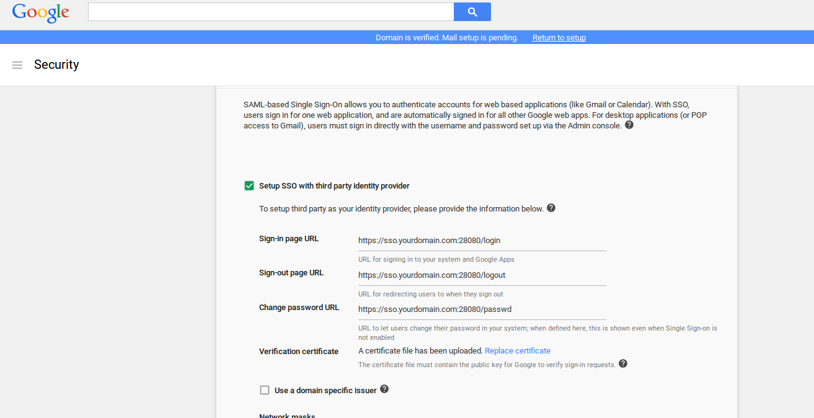
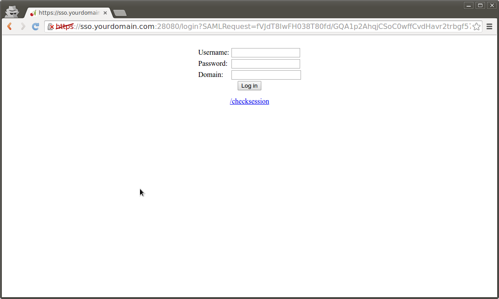
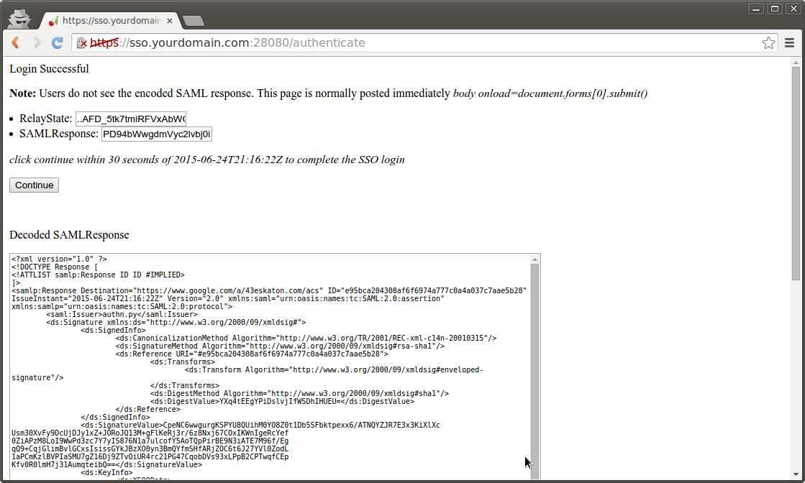

# googlapps-sso
Sample app for SSO between google apps domains.

This demonstrates SAML SSO with google properties and is is intended for *testing/POC only*

The script basically runs a SAML IDP within a docker container.

##To use:


### Configure Google Apps SAML/SSO
1. Login to your google apps admin console (admin.google.com/a/yourdomain.com)  
Navigate to [Apps SSO Config](https://admin.google.com/AdminHome?fral=1#SecuritySettings:flyout=sso)  
set following config depending on where you're running the IDP:  
    *  Login:  https://sso.idpdomain.com:28080/login  
    *  Logout: https://sso.idpdomain.com:28080/logout  
    *  Change Password: https://sso.idpdomain.com:28080/passwd 
    *  upload the public cert (ssl.crt) 
      * **NOTE** You do not ofcourse have touse the certificates provided here.  You can simply issue your own self-signed certificates as shown below: 
      *  Create public/private keypair or use ones provided in repo (remember to set the CN= to your domain; then CN provided in this repo is for sso.yourdomain.com)  
      *  If you want to generate your own keypairs:  
         ```openssl req -x509 -newkey rsa:2048 -keyout ssl.key -out ssl.crt -days 365 -nodes```  

2. Edit your local /etc/hosts file to point sso.yourdomain.com to the system running the container or SSO server

   ```/etc/hosts  127.0.0.1 localhost sso.idpdomain.com```  

3. There are several ways to run the image (in order of ease of use):
  *  Run the the pregenerated image directly from DockerHub
  *  Build and run the Docker image locally.
  *  Install the python libraries and run the script without Docker entirely.

### Pull from dockerhub
  pull [salrashid123/appsso](https://registry.hub.docker.com/u/salrashid123/appssso/)  
  * To use the certificates from this github repo, download ssl.key, ssl.crt into /tmp/certs (for example)
  * If you generated your own certs and uploaded those to the Google Apps SSO configuration page, copy those certificates to /tmp/certs  
  * run the image salrashid123/appssso  from dockerregistry but specify which folder to act as the map volume (so that your local certificates are visible to the container)  
```
  docker run -t -p 28080:28080 \
    -v `pwd`:/app/:ro \
    --entrypoint=/app/saml_idp_gsuites.py \
    salrashid123/appssso \
    --debug  \
    --cert_file=/app/server.crt \
    --key_file=/app/server.key
```  

### or Build docker local
4. Install docker
5. Make a folder called sso and copy apps.py and Dockerfile only.
6. As before, either generate new certificates or use the ones from this repo but place them into a folder you can map to the container (e.g. copy ssl.key, ssl.crt  to /tmp/certs).  You can, ofcourse, copy the certificates into the image at build time.  If you do that, copy the certs into the 'sso' folder from step 2 and omit the volume map and directoy /certs/ while running the container.
6. Create the docker container

```
  docker build -t appssso .
```

7. Run the container (assuming your local certs exist at /tmp/certs)
```
  docker run -t -p 28080:28080 \
    -v `pwd`:/app/:ro \
    --entrypoint=/app/saml_idp_gsuites.py \
    appssso \
    --debug  \
    --cert_file=/app/server.crt \
    --key_file=/app/server.key
```
8. At this point, the IDP is running locally on port sso.idpdomain.com:28080
9. If you attempt a new login to https://mail.google.com/a/yourdomain.com, you will get redirected to a login screen on your IDP  
10. The IDP will authenticate **ANY** user in your apps domain so if you have a user called user1@yourdomain.com, enter in 'user1', any password
      and yourdomain.com in the IDP login screen
11. If successful, you will get redirected to the SAML POST binding screen so  you can see the actual XML signed POST text.  
12. Click continue and if the sigatures and validUntil= parameters are ok, you will be logged in as user1

### or Run the IDP outside of a container
4. Dowload app.py and install the prerequsites via apt as shown in the script instructions
5. Download, compile pyxmlsec  (forget trying to install it on windows)  
6. Run  
```python apps.py --debug  --use_ssl --cert_file=ssl.crt --key_file=ssl.key --key_blank_pwd```
