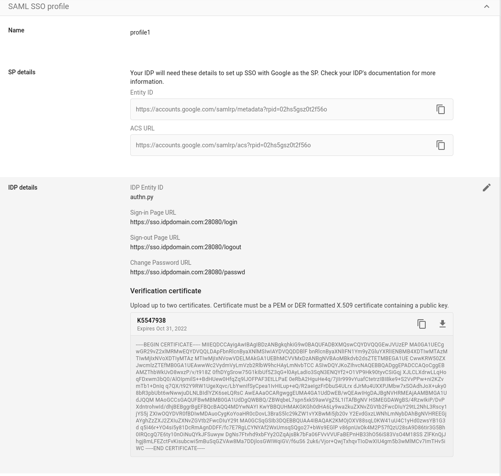

# googlapps-sso
Sample app for SSO between google apps domains.

This demonstrates SAML SSO with google properties and is is intended for *testing/POC only*

The script basically runs a SAML IDP within a docker container.

## To use:


### Configure Google Apps SAML/SSO
1. Login to your google apps admin console (admin.google.com/a/yourdomain.com)  
Navigate to [Apps SSO Config](https://admin.google.com/AdminHome?fral=1#SecuritySettings:flyout=sso)  
set following config depending on where you're running the IDP:  
    *  Login:  https://sso.idpdomain.com:28080/login  
    *  Logout: https://sso.idpdomain.com:28080/logout  
    *  Change Password: https://sso.idpdomain.com:28080/passwd 
    *  upload the public cert (ssl.crt) 
      * **NOTE** You do not ofcourse have touse the certificates provided here.  You can simply issue your own self-signed certificates as shown below: 
      *  Create public/private keypair or use ones provided in repo (remember to set the CN= to your domain; then CN provided in this repo is for sso.yourdomain.com)  
      *  If you want to generate your own keypairs:  
         ```openssl req -x509 -newkey rsa:2048 -keyout ssl.key -out ssl.crt -days 365 -nodes```  
    <!-- * If you are using SAML profiles per groups (eg, enable SAML only for specific groups):
      *  -->

2. Edit your local /etc/hosts file to point sso.yourdomain.com to the system running the container or SSO server

   ```/etc/hosts  127.0.0.1 localhost sso.idpdomain.com```  

3. There are several ways to run the image (in order of ease of use):
  *  Run the the pregenerated image directly from DockerHub
  *  Build and run the Docker image locally.
  *  Install the python libraries and run the script without Docker entirely.

### Pull from dockerhub
  pull [salrashid123/appsso](https://registry.hub.docker.com/u/salrashid123/appssso/)  
  * To use the certificates from this github repo, download ssl.key, ssl.crt into /tmp/certs (for example)
  * If you generated your own certs and uploaded those to the Google Apps SSO configuration page, copy those certificates to /tmp/certs  
  * run the image salrashid123/appssso  from dockerregistry but specify which folder to act as the map volume (so that your local certificates are visible to the container)  
```
  docker run -t -p 28080:28080 \
    -v `pwd`:/app/:ro \
    --entrypoint=/app/saml_idp_gsuites.py \
    salrashid123/appssso \
    --debug  \
    --cert_file=/app/server.crt \
    --key_file=/app/server.key
```  

### or Build docker local
4. Install docker
5. Make a folder called sso and copy apps.py and Dockerfile only.
6. As before, either generate new certificates or use the ones from this repo but place them into a folder you can map to the container (e.g. copy ssl.key, ssl.crt  to /tmp/certs).  You can, ofcourse, copy the certificates into the image at build time.  If you do that, copy the certs into the 'sso' folder from step 2 and omit the volume map and directory /certs/ while running the container.
6. Create the docker container

```
  docker build -t appssso .
```

7. Run the container (assuming your local certs exist at /tmp/certs)
```
  docker run -t -p 28080:28080 \
    -v `pwd`:/app/:ro \
    --entrypoint=/app/saml_idp_gsuites.py \
    appssso \
    --debug  \
    --cert_file=/app/server.crt \
    --key_file=/app/server.key
```
8. At this point, the IDP is running locally on port sso.idpdomain.com:28080
9. If you attempt a new login to https://mail.google.com/a/yourdomain.com, you will get redirected to a login screen on your IDP  
10. The IDP will authenticate **ANY** user in your apps domain so if you have a user called user1@yourdomain.com, enter in 'user1', any password
      and yourdomain.com in the IDP login screen
11. If successful, you will get redirected to the SAML POST binding screen so  you can see the actual XML signed POST text.  
12. Click continue and if the signatures and validUntil= parameters are ok, you will be logged in as user1

### or Run the IDP outside of a container
4. Dowload app.py and install the prerequsites via apt as shown in the script instructions
5. Download, compile pyxmlsec  (forget trying to install it on windows)  
6. Run  
```python apps.py --debug  --use_ssl --cert_file=ssl.crt --key_file=ssl.key --key_blank_pwd```


---

## Appendix


The following compares the SAML Request/Response between the SAML Profiles and original google apps SAML for Domain

---
#### SAML Request (Profile)

```
"GET /login?SAMLRequest=jZLNbtswEIRfReDdEkmHsUtYNoQEAQykRZCfHnopttTSJiCRKnflNn36Km7SpkGQ9sqdwcx%2By9Xme98VB8wUUqyFKqUoMLrUhrirxd3txWwpNusVQd/pwTYj7%2BM1fh2RuJiMkeyvSS3GHG0CCmQj9EiWnb1p3l9aXUo75MTJpU4UDRFmnqLOUqSxx3yD%2BRAc3l1f1mLPPJCtKnAujZGp3KW067B0qa8eYvIwjWiTh9DWUu/J7OiHZO3NaRLFRcoOj/1q4aEjFMX2vBafvTdeGm9gDnNt0JyqJZj5F1BeL/w7tZxkdAVE4YB/jEQjbiMxRK6FllrN5MlMmlulrV7YE12qhfwkio9P2KYlxSMkezTn53TehgNPSI479MBvyx9eQjvzR6nFyIHvxfo/0PXI0ALDq/xW1fPyv%2B/9YQrbnl%2BlLrj7oum69O0sI/BEivOI/y6sSvWycA%2Bha9o2I5Go1o%2B5f/%2Bs9U8%3D&RelayState=a.AM3QAYaIyyDsckO9IDFAhBCHyLWEqCQCyYHNV4KoG9CCzEhN3TGZ5rnqrPVdRNwD HTTP/1.1" 200 -
```

the [decoded SAMLRequest](https://developer.pingidentity.com/en/tools/saml-decoder.html)

Note, if you use SAML profiles, the XML namespace GCP sends is `sampl2p:` 

* SAML Profile
```xml
<?xml version="1.0" encoding="UTF-8"?>
<saml2p:AuthnRequest xmlns:saml2p="urn:oasis:names:tc:SAML:2.0:protocol" AssertionConsumerServiceURL="https://accounts.google.com/samlrp/acs?rpid=02hs5gsz0t2f56o" ForceAuthn="false" ID="_ff5f05f5a3a325e5618a53ba1f27f918" IsPassive="false" IssueInstant="2021-04-05T12:27:42.170Z" Version="2.0">
  <saml2:Issuer xmlns:saml2="urn:oasis:names:tc:SAML:2.0:assertion" Format="urn:oasis:names:tc:SAML:2.0:nameid-format:entity">https://accounts.google.com/samlrp/metadata?rpid=02hs5gsz0t2f56o</saml2:Issuer>
  <saml2p:NameIDPolicy AllowCreate="true" Format="urn:oasis:names:tc:SAML:1.1:nameid-format:emailAddress"/>
</saml2p:AuthnRequest>
```

#### SAML Response (Profile)


```xml
<?xml version="1.0" ?>
<saml2p:Response ID="_2da8e2675639cc24fad930b1e3417b3" InResponseTo="_ff5f05f5a3a325e5618a53ba1f27f918" IssueInstant="2021-04-05T12:27:45Z" Version="2.0" xmlns:saml2p="urn:oasis:names:tc:SAML:2.0:protocol">
	<saml2:Issuer Format="urn:oasis:names:tc:SAML:2.0:nameid-format:entity" xmlns:saml2="urn:oasis:names:tc:SAML:2.0:assertion">authn.py</saml2:Issuer>
	<ds:Signature xmlns:ds="http://www.w3.org/2000/09/xmldsig#">
		<ds:SignedInfo>
			<ds:CanonicalizationMethod Algorithm="http://www.w3.org/2001/10/xml-exc-c14n#"/>
			<ds:SignatureMethod Algorithm="http://www.w3.org/2000/09/xmldsig#rsa-sha1"/>
			<ds:Reference URI="#_2da8e2675639cc24fad930b1e3417b3">
				<ds:Transforms>
					<ds:Transform Algorithm="http://www.w3.org/2000/09/xmldsig#enveloped-signature"/>
					<ds:Transform Algorithm="http://www.w3.org/2001/10/xml-exc-c14n#"/>
				</ds:Transforms>
				<ds:DigestMethod Algorithm="http://www.w3.org/2000/09/xmldsig#sha1"/>
				<ds:DigestValue>NN4YrOUpz+g3aGKohbBSDAfOJTM=</ds:DigestValue>
			</ds:Reference>
		</ds:SignedInfo>
		<ds:SignatureValue>vQruO+8EzZUqHbkmtpKJe9sNGglrGBZGkMvJu0TY+ATCYxMmPI6XIHt1HVj9Ejh2
jZet9pTQPAKrCqE70Ueo8aoryA16PnaqxWT0yKTIP7Ykt5tWoV8G2+B0sT7wB7Yi
2rXJwZUJ7w0YkmOZ7LOMPrzUr6HSDcmtwzTJBffLMUlvle0snWO6AC3hUWsvy8g/
q3DumXcDnbisTsB3hhGJGZ+KG13Cnilbp8P0nbbV5EN9vOV2PcGJRaD22cWNvsgA
dKEPiMJscHFyafnxhWHCS+ceJM/tcWDMNwkifWhqmQQWZvJ/4eT4uQaIrZluu6jG
haYGt3h5t130G4N2eFfXGQ==</ds:SignatureValue>
		<ds:KeyInfo>
			<ds:X509Data>
				

				<ds:X509Certificate>MIIEQDCCAyigAwIBAgIBDzANBgkqhkiG9w0BAQUFADBXMQswCQYDVQQGEwJVUzEP
MA0GA1UECgwGR29vZ2xlMRMwEQYDVQQLDApFbnRlcnByaXNlMSIwIAYDVQQDDBlF
bnRlcnByaXNlIFN1Ym9yZGluYXRlIENBMB4XDTIwMTAzMTIwMjIxNVoXDTIyMTAz
MTIwMjIxNVowVDELMAkGA1UEBhMCVVMxDzANBgNVBAoMBkdvb2dsZTETMBEGA1UE
CwwKRW50ZXJwcmlzZTEfMB0GA1UEAwwWc2VydmVyLmVzb2RlbW9hcHAyLmNvbTCC
ASIwDQYJKoZIhvcNAQEBBQADggEPADCCAQoCggEBAMZThbWkUvD8wxzP/v/t918Z
0fhDYgSrow75G1kIbUf5Z3qG+l0AyLadIo3SqN3ENQYf2+O1VP9Hk90tyvCSiGqj
XJLCLXdrwLLqHoqFDxwm3bQ0/AlOIpmilS++BdHUew0HfqZq9lJOFPAF3EtLLPaE
0eRbA2HguHe4q/7jIIr999vYuafCtetrzIBI8ke9+S2VvPPw+ni2KZvmTb1+DnIq
q7QX/t92Y9RW1UgeXqvc/LbYwnIfSyCpea1IvHILup+eQ/R2aeIgzFrDbuS4ULrx
dJrMu4UXXPJMbw7xSOAdhJoX+uky08bR3pbUbt6wNwwjuDLNLBIdlYZK6seLQRsC
AwEAAaOCARgwggEUMA4GA1UdDwEB/wQEAwIHgDAJBgNVHRMEAjAAMBMGA1UdJQQM
MAoGCCsGAQUFBwMBMB0GA1UdDgQWBBQ/ZBWqbeL7spn5xkS9awVgZ5L1ITAfBgNV
HSMEGDAWgBS/4RzwIkiP/DvPXdntrohwId/dhjBEBggrBgEFBQcBAQQ4MDYwNAYI
KwYBBQUHMAKGKGh0dHA6Ly9wa2kuZXNvZGVtb2FwcDIuY29tL2NhL3Rscy1jYS5j
ZXIwOQYDVR0fBDIwMDAuoCygKoYoaHR0cDovL3BraS5lc29kZW1vYXBwMi5jb20v
Y2EvdGxzLWNhLmNybDAhBgNVHREEGjAYghZzZXJ2ZXIuZXNvZGVtb2FwcDIuY29t
MA0GCSqGSIb3DQEBBQUAA4IBAQAK2KMOjOXV88sqL0KW41uU4C1yHd0zwsYB1G3d
q5I46r+YO4si5y81DcRmAgnDDFF/fc7E7RgLCYNYAf2WxUmsqSQgo27+bWs9EGlP
v86pnUxOk4M2P57fQzU28sA9D86tir3G5Bh0IRQcgQ7E6ty10nOiNuQYkJFSuwyw
DgNs7Ftvhd9xbFYy2OZqAjsBk7bFa06FVvVVUFaBEPnHB33hO56iS83VsO4M18SS
ZlFKnQjJhgj8mLFEZctFvKisubcwi5mBuSqGZVAw8Ma7DDjlosGWIWqiGV/f6uS6
2uk6/Vjor+QwjTxhqvTIoDwXIU4gm5b3wMlMCv7ImTHv5iWC</ds:X509Certificate>
				

			</ds:X509Data>
		</ds:KeyInfo>
	</ds:Signature>
	<saml2p:Status xmlns:saml2p="urn:oasis:names:tc:SAML:2.0:protocol">
		<saml2p:StatusCode Value="urn:oasis:names:tc:SAML:2.0:status:Success"/>
	</saml2p:Status>
	<saml2:Assertion ID="_aae9f3deca29e911d55308ff15b9cc7" IssueInstant="2021-04-05T12:27:45Z" Version="2.0" xmlns:saml2="urn:oasis:names:tc:SAML:2.0:assertion">
		<saml2:Issuer Format="urn:oasis:names:tc:SAML:2.0:nameid-format:entity">authn.py</saml2:Issuer>
		<saml2:Subject>
			<saml2:NameID Format="urn:oasis:names:tc:SAML:1.1:nameid-format:unspecified">user1@esodemoapp2.com</saml2:NameID>
			<saml2:SubjectConfirmation Method="urn:oasis:names:tc:SAML:2.0:cm:bearer">
				<saml2:SubjectConfirmationData InResponseTo="_ff5f05f5a3a325e5618a53ba1f27f918" NotOnOrAfter="2021-04-05T13:17:45Z" Recipient="https://accounts.google.com/samlrp/acs?rpid=02hs5gsz0t2f56o"/>
			</saml2:SubjectConfirmation>
		</saml2:Subject>
		<saml2:Conditions NotBefore="2021-04-05T12:27:45Z" NotOnOrAfter="2021-04-05T13:17:45Z">
			<saml2:AudienceRestriction>
				<saml2:Audience>https://accounts.google.com/samlrp/metadata?rpid=02hs5gsz0t2f56o</saml2:Audience>
			</saml2:AudienceRestriction>
		</saml2:Conditions>
		<saml2:AuthnStatement AuthnInstant="2021-04-05T12:27:45Z" SessionIndex="_aae9f3deca29e911d55308ff15b9cc7">
			<saml2:AuthnContext>
				<saml2:AuthnContextClassRef>urn:oasis:names:tc:SAML:2.0:ac:classes:PasswordProtectedTransport</saml2:AuthnContextClassRef>
			</saml2:AuthnContext>
		</saml2:AuthnStatement>
	</saml2:Assertion>
</saml2p:Response>
```

---

#### SAML Request (Domain)

```xml
<?xml version="1.0" encoding="UTF-8"?>
<samlp:AuthnRequest xmlns:samlp="urn:oasis:names:tc:SAML:2.0:protocol" ID="dieoibobioiggldaoaiemkakcbpffhbdmppeoode" Version="2.0" IssueInstant="2021-04-05T12:30:40Z" ProtocolBinding="urn:oasis:names:tc:SAML:2.0:bindings:HTTP-POST" ProviderName="google.com" IsPassive="false" AssertionConsumerServiceURL="https://www.google.com/a/esodemoapp2.com/acs">
  <saml:Issuer xmlns:saml="urn:oasis:names:tc:SAML:2.0:assertion">google.com</saml:Issuer>
  <samlp:NameIDPolicy AllowCreate="true" Format="urn:oasis:names:tc:SAML:1.1:nameid-format:unspecified"/>
</samlp:AuthnRequest>
```

#### SAML Response (Domain)

```xml
<?xml version="1.0" ?>
<samlp:Response Destination="https://www.google.com/a/esodemoapp2.com/acs" ID="_42dfc2173138837ac02982337a6e33a" InResponseTo="dieoibobioiggldaoaiemkakcbpffhbdmppeoode" IssueInstant="2021-04-05T12:30:44Z" Version="2.0" xmlns:saml="urn:oasis:names:tc:SAML:2.0:assertion" xmlns:samlp="urn:oasis:names:tc:SAML:2.0:protocol">
	<saml:Issuer>authn.py</saml:Issuer>
	<ds:Signature xmlns:ds="http://www.w3.org/2000/09/xmldsig#">
		<ds:SignedInfo>
			<ds:CanonicalizationMethod Algorithm="http://www.w3.org/TR/2001/REC-xml-c14n-20010315"/>
			<ds:SignatureMethod Algorithm="http://www.w3.org/2000/09/xmldsig#rsa-sha1"/>
			<ds:Reference URI="#_42dfc2173138837ac02982337a6e33a">
				<ds:Transforms>
					<ds:Transform Algorithm="http://www.w3.org/2000/09/xmldsig#enveloped-signature"/>
				</ds:Transforms>
				<ds:DigestMethod Algorithm="http://www.w3.org/2000/09/xmldsig#sha1"/>
				<ds:DigestValue>7GHJw5xRX1CSq9PuXN8cWttIiKI=</ds:DigestValue>
			</ds:Reference>
		</ds:SignedInfo>
		<ds:SignatureValue>ur4rnmw9MLoZzfmOR0zSWZtYWmUZ524vyve7G6NjAKCQfXTnMceLhatPKSp+dm13
vBpiYfFQldsgjN1882g3Dv6EMkul9MM3ftxJI2i185XN+hkb1AM6CzHKbgTlfgiw
1KdaStkJOimY1PMZfI/J5E7HSeOnxjbGf7ZhYXM0nGywxL78s+OhT/26YOoV+5Gp
fMDl+S/yMJI+K5owh/vOkE3uv160qoANGHBBiSxMSxSmwNMt3ZoRFA4qZYbqLm9e
IOmK0HNldK/Gj/FdqfL7mhHus7WqfeC5UoV/aHzEgc5DUeppJhee7d3zF00cTjiT
i3j0tcLl4qmQKJ8mGzWcfQ==</ds:SignatureValue>
		<ds:KeyInfo>
			<ds:X509Data>
				

				<ds:X509Certificate>MIIEQDCCAyigAwIBAgIBDzANBgkqhkiG9w0BAQUFADBXMQswCQYDVQQGEwJVUzEP
MA0GA1UECgwGR29vZ2xlMRMwEQYDVQQLDApFbnRlcnByaXNlMSIwIAYDVQQDDBlF
bnRlcnByaXNlIFN1Ym9yZGluYXRlIENBMB4XDTIwMTAzMTIwMjIxNVoXDTIyMTAz
MTIwMjIxNVowVDELMAkGA1UEBhMCVVMxDzANBgNVBAoMBkdvb2dsZTETMBEGA1UE
CwwKRW50ZXJwcmlzZTEfMB0GA1UEAwwWc2VydmVyLmVzb2RlbW9hcHAyLmNvbTCC
ASIwDQYJKoZIhvcNAQEBBQADggEPADCCAQoCggEBAMZThbWkUvD8wxzP/v/t918Z
0fhDYgSrow75G1kIbUf5Z3qG+l0AyLadIo3SqN3ENQYf2+O1VP9Hk90tyvCSiGqj
XJLCLXdrwLLqHoqFDxwm3bQ0/AlOIpmilS++BdHUew0HfqZq9lJOFPAF3EtLLPaE
0eRbA2HguHe4q/7jIIr999vYuafCtetrzIBI8ke9+S2VvPPw+ni2KZvmTb1+DnIq
q7QX/t92Y9RW1UgeXqvc/LbYwnIfSyCpea1IvHILup+eQ/R2aeIgzFrDbuS4ULrx
dJrMu4UXXPJMbw7xSOAdhJoX+uky08bR3pbUbt6wNwwjuDLNLBIdlYZK6seLQRsC
AwEAAaOCARgwggEUMA4GA1UdDwEB/wQEAwIHgDAJBgNVHRMEAjAAMBMGA1UdJQQM
MAoGCCsGAQUFBwMBMB0GA1UdDgQWBBQ/ZBWqbeL7spn5xkS9awVgZ5L1ITAfBgNV
HSMEGDAWgBS/4RzwIkiP/DvPXdntrohwId/dhjBEBggrBgEFBQcBAQQ4MDYwNAYI
KwYBBQUHMAKGKGh0dHA6Ly9wa2kuZXNvZGVtb2FwcDIuY29tL2NhL3Rscy1jYS5j
ZXIwOQYDVR0fBDIwMDAuoCygKoYoaHR0cDovL3BraS5lc29kZW1vYXBwMi5jb20v
Y2EvdGxzLWNhLmNybDAhBgNVHREEGjAYghZzZXJ2ZXIuZXNvZGVtb2FwcDIuY29t
MA0GCSqGSIb3DQEBBQUAA4IBAQAK2KMOjOXV88sqL0KW41uU4C1yHd0zwsYB1G3d
q5I46r+YO4si5y81DcRmAgnDDFF/fc7E7RgLCYNYAf2WxUmsqSQgo27+bWs9EGlP
v86pnUxOk4M2P57fQzU28sA9D86tir3G5Bh0IRQcgQ7E6ty10nOiNuQYkJFSuwyw
DgNs7Ftvhd9xbFYy2OZqAjsBk7bFa06FVvVVUFaBEPnHB33hO56iS83VsO4M18SS
ZlFKnQjJhgj8mLFEZctFvKisubcwi5mBuSqGZVAw8Ma7DDjlosGWIWqiGV/f6uS6
2uk6/Vjor+QwjTxhqvTIoDwXIU4gm5b3wMlMCv7ImTHv5iWC</ds:X509Certificate>
				

			</ds:X509Data>
		</ds:KeyInfo>
	</ds:Signature>
	<samlp:Status>
		<samlp:StatusCode Value="urn:oasis:names:tc:SAML:2.0:status:Success"/>
	</samlp:Status>
	<saml:Assertion ID="_dc3675c3620ba1f20e7feea6d174b8b" IssueInstant="2021-04-05T12:30:44Z" Version="2.0">
		<saml:Issuer>authn.py</saml:Issuer>
		<saml:Subject>
			<saml:NameID>user1@esodemoapp2.com</saml:NameID>
			<saml:SubjectConfirmation Method="urn:oasis:names:tc:SAML:2.0:cm:bearer">
				<saml:SubjectConfirmationData InResponseTo="dieoibobioiggldaoaiemkakcbpffhbdmppeoode" NotOnOrAfter="2021-04-05T13:20:44Z" Recipient="https://www.google.com/a/esodemoapp2.com/acs"/>
			</saml:SubjectConfirmation>
		</saml:Subject>
		<saml:Conditions NotBefore="2021-04-05T12:30:44Z" NotOnOrAfter="2021-04-05T13:20:44Z">
			<saml:AudienceRestriction>
				<saml:Audience>google.com</saml:Audience>
			</saml:AudienceRestriction>
		</saml:Conditions>
		<saml:AuthnStatement AuthnInstant="2021-04-05T12:30:44Z" SessionIndex="_dc3675c3620ba1f20e7feea6d174b8b">
			<saml:AuthnContext>
				<saml:AuthnContextClassRef>urn:oasis:names:tc:SAML:2.0:ac:classes:Password</saml:AuthnContextClassRef>
			</saml:AuthnContext>
		</saml:AuthnStatement>
	</saml:Assertion>
</samlp:Response>
```

