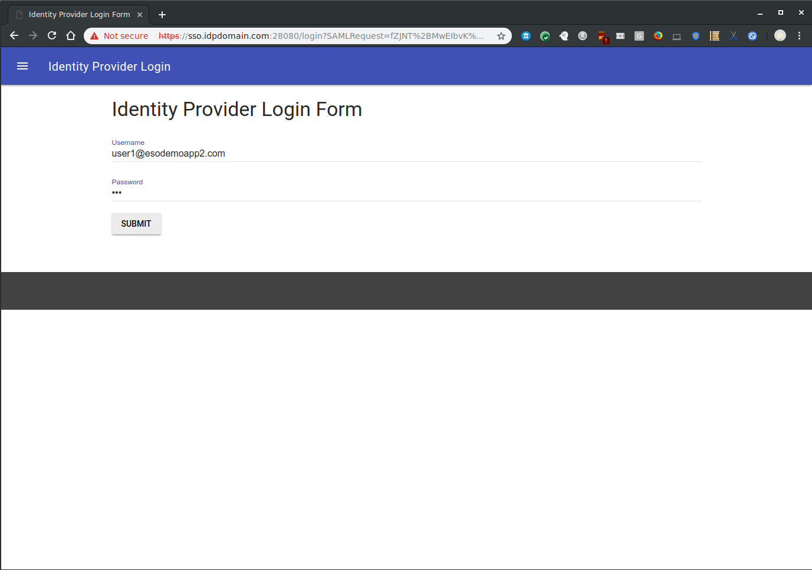
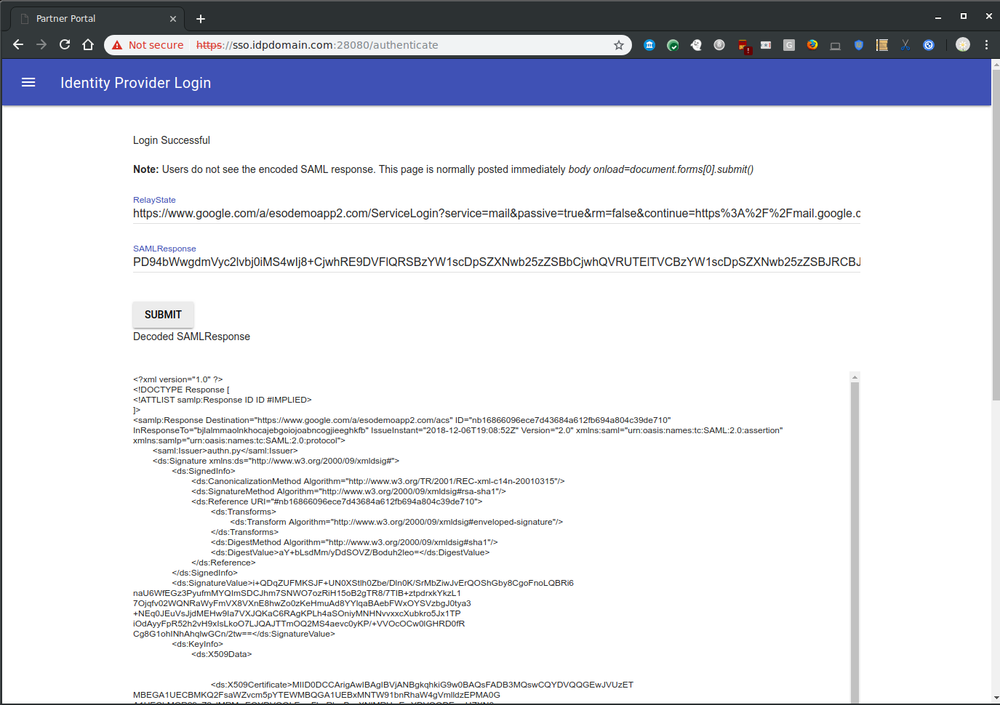

# googlapps-sso
Sample app for SSO between google apps domains.

This demonstrates SAML SSO with google properties and is is intended for *testing/POC only*

The script basically runs a SAML IDP within a docker container.

##To use:
### Configure Google Apps SAML/SSO
1. Create public/private keypair or use ones provided in repo
*remember to set the CN= to your domain
*the certificates provided in github is set for sso.yourdomain.com
If you want to generate your own keypairs:
```openssl req -x509 -newkey rsa:2048 -keyout ssl.key -out ssl.crt -days 365 -nodes```  

2. Login to your google apps admin console (admin.google.com/a/yourdomain.com)  
Navigate to [Apps SSO Config](https://admin.google.com/AdminHome?fral=1#SecuritySettings:flyout=sso)  
set following config depending on where you're running the IDP:  
  *  Login:  https://sso.yourdomain.com:28080/login  
  *  Logout: https://sso.yourdomain.com:28080/logout  
  *  Change Password: https://sso.yourdomain.com:28080/passwd  
  *  upload the public cert (ssl.crt)  
3. If you are running the docker container locally,  
  On your laptop the hosts file and set your domain to localhost  
```/etc/hosts  127.0.0.1 localhost sso.yourdomain.com```  
  What this will do is use your local laptop as your IDP server.  

### Pull from dockerhub
  pull [salrashid123/appsso](https://registry.hub.docker.com/u/salrashid123/appssso/)  
  * download apps.py, ssl* and Docker file from github repo  
  * run the image salrashid123/appssso  from dockerregistry  
  ```docker run -t -p 28080:28080 salrashid123/appssso --debug  --use_ssl --cert_file=ssl.crt --key_file=ssl.key --key_blank_pwd```  

### or Build docker local
4. Install docker
5. Make a folder called sso and copy all the files from the github repo into it (apps.py, ssl*, Dockerfile)
6. Create the docker container
```docker build -t appssso .```
7. Run the container
```docker run -t -p 28080:28080 appssso --debug  --use_ssl --cert_file=ssl.crt --key_file=ssl.key --key_blank_pwd```
8. At this point, the IDP is running locally on port sso.yourdomain.com:28080
9. If you attempt a new login to https://mail.google.com/a/yourdomain.com, you will get redirected to a login screen on your IDP  
10. The IDP will authenticate **ANY** user in your apps domain so if you have a user called user1@yourdomain.com, enter in 'user1', any password
      and yourdomain.com in the IDP login screen
11. If successful, you will get redirected to the SAML POST binding screen so  you can see the actual XML signed POST text.  
12. Click continue and if the sigatures and validUntil= parameters are ok, you will be logged in as user1

### or Run the IDP outside of a container
4. Dowload app.py and install the prerequsites via apt as shown in the script instructions
5. Download, compile pyxmlsec
6. Run  
 ```python apps.py --debug  --use_ssl --cert_file=ssl.crt --key_file=ssl.key --key_blank_pwd```
